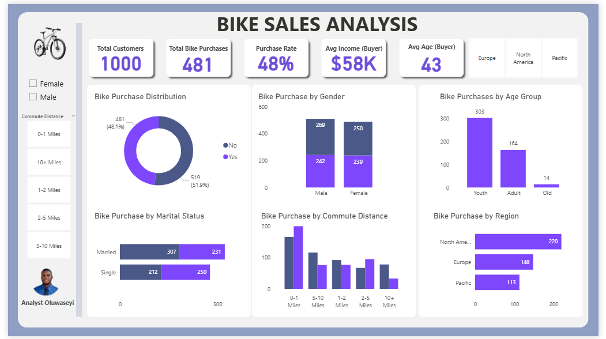

# Bike Sales Analysis Dashboard (Power BI)

## Project Overview
This project examines customer demographics and lifestyle factors to understand the factors that influence bike purchasing behavior. The goal was to identify high-converting customer segments and provide actionable insights for sales and marketing decisions.

## Problem Statement
Bike sales performance varies across customer groups. This project explores how factors such as age, gender, marital status, commute distance, income, and region influence bike purchase decisions.

## Dataset Description
- 1,000 customer records
- Demographic data (age, gender, marital status)
- Lifestyle data (commute distance)
- Financial data (income)
- Geographic data (region)
- Target variable: Bike Purchase (Yes / No)

## Tools Used
- Power BI
- DAX (Measures)
- Data cleaning and transformation

## Key KPIs
- Total Customers
- Total Bike Purchases
- Purchase Rate (%)
- Average Income of Buyers
- Average Age of Buyers

## Key Questions Answered
- What percentage of customers purchase bikes?
- Which age groups are most likely to buy bikes?
- How does purchase behavior differ by gender and marital status?
- Does commute distance influence bike purchases?
- Which regions generate the most bike sales?

## Key Insights
- Younger customers account for the highest number of bike purchases.
- Customers with shorter commute distances show stronger purchase behavior.
- North America leads in total bike purchases.
- Bike purchase behavior shows slight variation across gender and marital status.

## Outcome
The dashboard provides a clear, interactive view of bike purchase behavior, enabling stakeholders to identify high-value customer segments and focus marketing and sales strategies effectively.

## Preview

